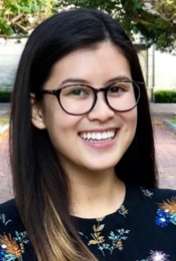
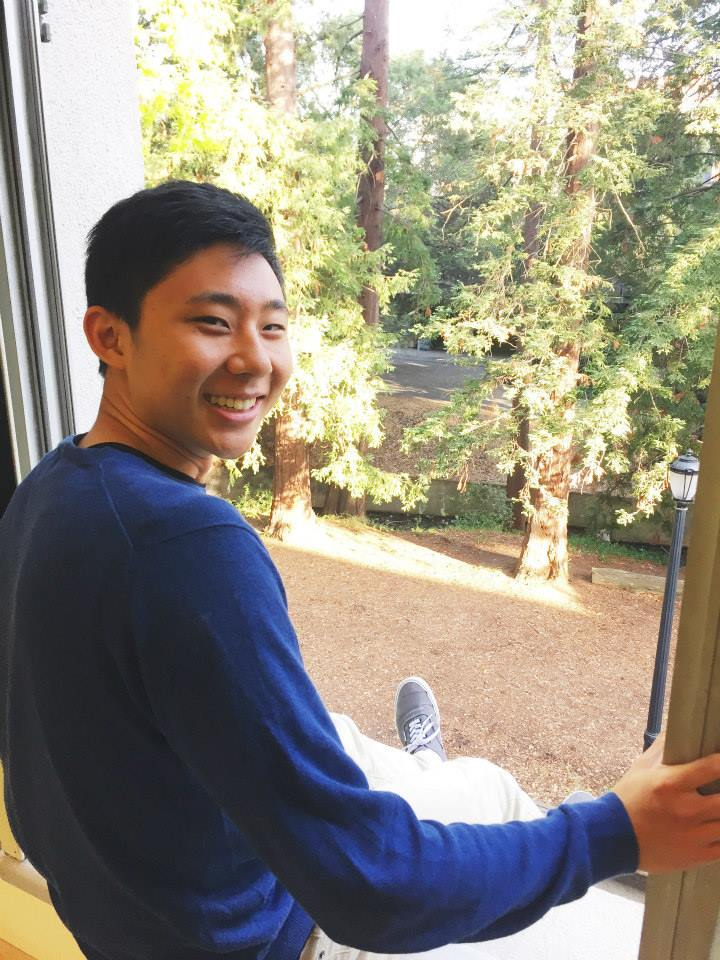

<!-- # DS100: Principles & Techniques of Data Science -->

Combining data, computation, and inferential thinking, data science is
redefining how people and organizations solve challenging problems and
understand their world. This intermediate level class bridges between
[Data8](http://data8.org) and upper division computer science and statistics
courses as well as methods courses in other fields. In this class, we explore
key areas of data science including question formulation, data collection and
cleaning, visualization, statistical inference, predictive modeling, and
decision making.​ Through a strong emphasizes on data centric computing,
quantitative critical thinking, and exploratory data analysis this class covers
key principles and techniques of data science. These include languages for
transforming, querying and analyzing data; algorithms for machine learning
methods including regression, classification and clustering; principles behind
creating informative data visualizations; statistical concepts of measurement
error and prediction; and techniques for scalable data processing.

This class is listed as [STAT C100](http://classes.berkeley.edu/content/2017-fall-stat-c100-001-lec-001) and as [COMPSCI C100](http://classes.berkeley.edu/content/2017-fall-compsci-c100-001-lec-001).

## Important Information:

* **When:** Lectures Tuesdays and Thursdays from 11:00AM to 12:30PM
* **Where:** [150 Wheeler ](http://www.berkeley.edu/map?wheeler)
* **What:** See the [lecture schedule](syllabus)
* **News:** We will post updates about the class on [Piazza](https://piazza.com/berkeley/spring2018/data100/home)

If you have issues with enrollment contact: <a href="mailto:csconners@cs.berkeley.edu?subject=[DS100 Enrollment]">Cindy Conners</a>

<!--

If you have enrolled in the wait-list please complete the following  <a href="https://goo.gl/forms/Ku5cu7L7cUbSaTKc2">Background Survey</a> we will use this to help in admitting students into the class.  Please sign up for Piazza to follow updates on the wait list.
 -->

## Office Hours, Section, and Lab Schedule

  <iframe src="https://calendar.google.com/calendar/embed?title=Data%20100%20Discussion%2C%20Lab%2C%20Office%20Hours&amp;mode=WEEK&amp;height=600&amp;wkst=1&amp;bgcolor=%23FFFFFF&amp;src=berkeley.edu_3iothuu50b7vt60vh265urvkgg%40group.calendar.google.com&amp;color=%2342104A&amp;src=berkeley.edu_q7fe1ocb0v0kdofsf0jb6tnv10%40group.calendar.google.com&amp;color=%23182C57&amp;ctz=America%2FLos_Angeles" style="border-width:0" frameborder="0" scrolling="no"></iframe>

For official holidays see the [academic calendar](http://registrar.berkeley.edu/sites/default/files/pdf/UCB_AcademicCalendar_2017-18_V3.pdf).

## Goals

* **Prepare** students for advanced Berkeley courses in data-management, machine learning, and statistics, by providing the necessary foundation and context

* **Enable** students to start careers as data scientists by providing experience working with real-world data, tools, and techniques

* **Empower** students to apply computational and inferential thinking to address real-world problems

## Prerequisites

While we are working to make this class widely accessible we currently require the following (or equivalent) prerequisites :

1. **Foundations of Data Science:** [**Data8**](http://data8.org/fa16/) covers much of the material in DS100 but at an introductory level.  Data8 provides basic exposure to python programming and working with tabular data as well as visualization, statistics, and machine learning.

1. **Computing:** *The Structure and Interpretation of Computer Programs* [**CS61A**](http://cs61a.org) or *Computational Structures in Data Science* [**CS88**](http://cs88-website.github.io).   These courses provide additional background in python programming (e.g., *for loops*, *lambdas*, *debugging*, and *complexity*) that will enable DS100 to focus more on the concepts in Data Science and less on the details of programming in python.

1. **Math:** *Linear Algebra* ([Math 54](https://math.berkeley.edu/~nadler/54fall2015.html), [EE 16a](http://inst.eecs.berkeley.edu/~ee16a/fa16/), or [Stat89a](https://www.stat.berkeley.edu/~mmahoney/s18-lads/)): We will need some basic concepts like linear operators, eigenvectors, derivatives, and integrals to enable statistical inference and derive new prediction algorithms.  This may be satisfied concurrently to DS100.

## Instructors

<section class="staff">
  

    
    <address>
      <strong>Joseph E. Gonzalez</strong> 
      <a href="mailto:jegonzal@cs.berkeley.edu">jegonzal@cs.berkeley.edu</a>
    </address>
  

  

    
    <address>
      <strong>Fernando Perez</strong> 
      <a href="mailto:Fernando.Perez@berkeley.edu">Fernando.Perez@berkeley.edu</a>
    </address>
  

</section>

## Teaching Assistants

<section class="staff">

  

    
    <address>
      <strong>Biye Jiang</strong> 
      <a href="mailto:bjiang@berkeley.edu">bjiang@berkeley.edu</a>
    </address>
  

  

    
    <address>
      <strong>Jake Soloff</strong> 
      <a href="mailto:jake_soloff@berkeley.edu">jake_soloff@berkeley.edu</a>
    </address>
  

  

    
    <address>
      <strong>Sona Jeswani</strong> 
      <a href="mailto:sona.jeswani@berkeley.edu">sona.jeswani@berkeley.edu</a>
    </address>
  

  

    
    <address>
      <strong>Nhi Quach</strong> 
      <a href="mailto:nhiquach@berkeley.edu">nhiquach@berkeley.edu</a>
    </address>
  

  

    
    <address>
      <strong>Andrew Do</strong> 
      <a href="mailto:do@berkeley.edu">do@berkeley.edu</a>
    </address>
  

  

    
    <address>
      <strong>Edward Fang</strong> 
      <a href="mailto:edward.fang@berkeley.edu">edward.fang@berkeley.edu</a>
    </address>
  

  

    
    <address>
      <strong>Manana Hakobyan</strong> 
      <a href="mailto:manana.hakyoban@berkeley.edu">manana.hakyoban@berkeley.edu</a>
    </address>
  

  

    
    <address>
      <strong>Caleb Siu</strong> 
      <a href="mailto:calebs11@berkeley.edu">calebs11@berkeley.edu</a>
    </address>
  

  

    
    <address>
      <strong>Joyce Lo</strong> 
      <a href="mailto:jsylo@berkeley">jsylo@berkeley.edu</a>
    </address>
  

  

    
    <address>
      <strong>Louis Remus</strong> 
      <a href="mailto:louis.remus@berkeley.edu">louis.remus@berkeley.edu</a>
    </address>
  

  

    
    <address>
      <strong>Simon Mo</strong> 
      <a href="mailto:xmo@berkeley.edu">xmo@berkeley.edu</a>
    </address>
  

  
  

    
    <address>
      <strong>Justin Kang</strong> 
      <a href="mailto:justinkangg@berkeley.edu">justinkangg@berkeley.edu</a>
    </address>
  

  
  

    
    <address>
      <strong>Aman Dhar</strong> 
      <a href="mailto:amandhar@berkeley.edu">amandhar@berkeley.edu</a>
    </address>
  

  
  

    
    <address>
      <strong>Karina Goot</strong> 
      <a href="mailto:kgoot@berkeley.edu">kgoot@berkeley.edu</a>
    </address>
  

  
  

    
    <address>
      <strong>Aakash Bhalothia</strong> 
      <a href="mailto:aakash.bhalothia@berkeley.edu">aakash.bhalothia@berkeley.edu</a>
    </address>
  

  

    
    <address>
      <strong>Weiwei Zhang</strong> 
      <a href="mailto:weiwzhang@berkeley.edu">weiwzhang@berkeley.edu</a>
    </address>
  

<section class="staff">
</section>

## Undergraduate Research Opportunities

Berkeley is an amazing place to learn about and participate in research.  We strongly encourage students to look for research opportunities as well as opportunities to get involved in building the tools used by data scientists around the world.  The following is a list of research and development opportunities:

1. Professor Gonzalez is often looking for undergraduates to get involved in his many projects.  If you are interested in getting involved stop by office hours and [complete this google form.](https://goo.gl/forms/aWk5acQsw56BvbRj1)
1. The Berkeley Institute for Data science has many opportunities for research.  Attend [these events](https://bids.berkeley.edu/events) and learn more about what people are doing and ask them how you can help.
1. Take a look at some of the issues on big open source projects and consider getting involved in addressing them:  
  * [Jupyter](https://github.com/jupyter/jupyter/issues)
  * [nbgrader](https://github.com/jupyter/nbgrader/issues)
  * [sklearn](https://github.com/scikit-learn/scikit-learn/issues)

